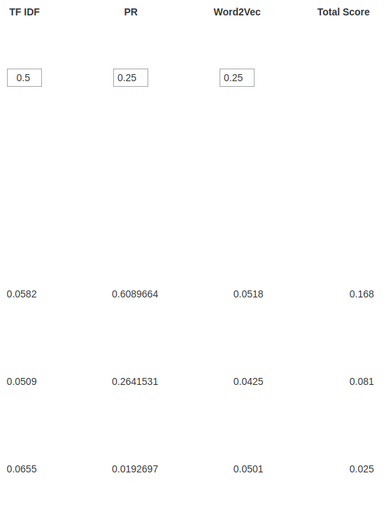
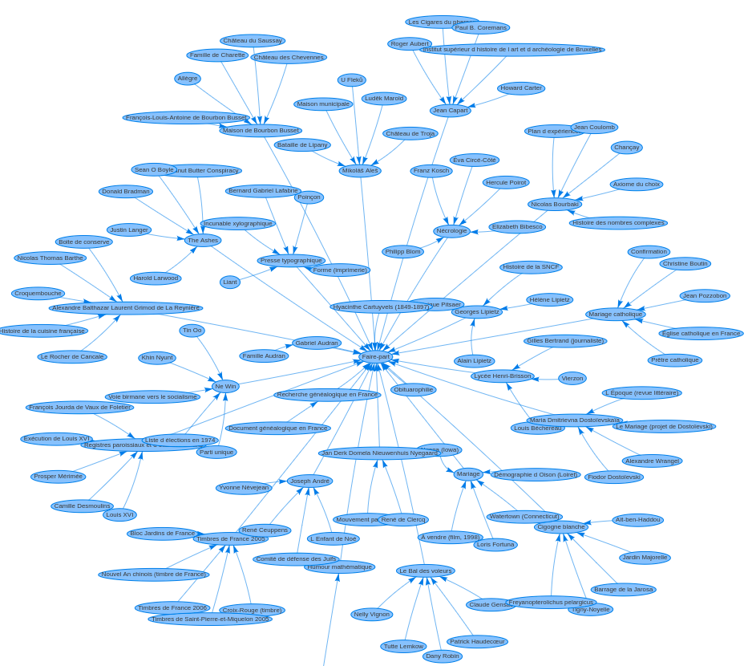
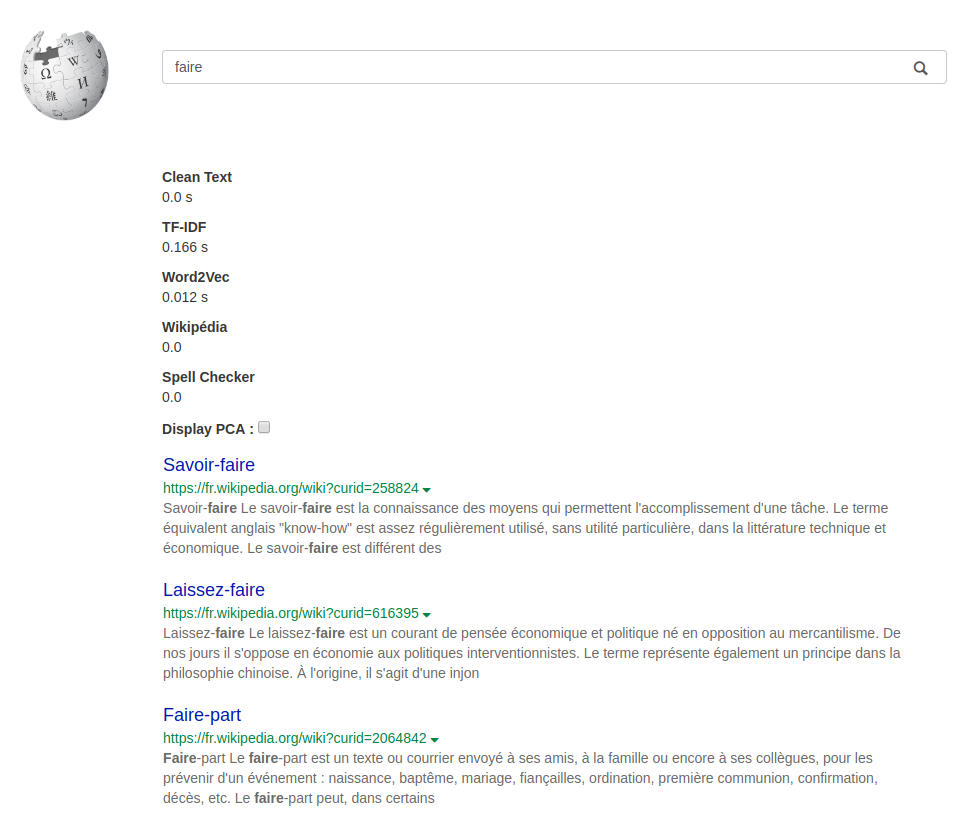

# Search Engine for French Wikipedia

All the project is done using Python (Django). The database is using sqlite3.

## Preprocessing :

- Downloading Wikipedia Articles from https://dumps.wikimedia.org/frwiki
- Extracting the files with https://github.com/attardi/wikiextractor, keep links, and save it as json format
- You get a set of repositories and files where each row in each file is an article

- Save into a database all the words encountered into the articles and their frequency over all the French Wikipedia articles
- Save the source and the target for each link between 2 wikipedia pages
- Save the informations about all the articles (index of the row in the matrix,wikipedia id,title,url,absolute path towards the file containing it on my laptop, the index of the line containing the article in this file)
- Compute for each article its word2vec vector (using a Word2Vec with a 200 dimensions embedding) and save it into the database
- Compute the tf-idf matrix while keeping only 60% of the most frequent words into wikipedia and save it into a sparse format (a file)
- Compute the PageRank of each page using restart and save it into the database

## On the fly :

- Spell Checker of the sentence
- Sorting the articles using tf-idf, Word2vec distance and PageRank metrics
- Display the graph of the ancestors for each article
- Showing a preview of each article by highlighting the common parts between the query and the article text

## How it's done :

The search is mainly based on the tf-idf matrix. When the user query something, it removes the stop words from the query and then searches the articles with the best cosinus distance into the tf-idf matrix. We only keep k of these articles. The value of k is chosen by the user (by typing its value into the URL). Finally we display for the user these articles, only the order of presentation depends on : 
- The tf-idf value of the article for this query
- The Word2Vec distance between the query and the mean Word2Vec vector of each article
- The PageRank value of the article  
You can set a coefficient to each of these metrics to tune the order.

A spell checker has been implemented but works poorly, it's mainly based on the great article from Peter Norvig : https://norvig.com/spell-correct.html and the Word2Vec distance between the potential words and the other well spelled words of the sentence. Indeed, a Word2vec model is build using the similarity of a word with his neighbours, so we thought it would be a great tool to improve the spell correction.

You can also display the graph of the ancestors of each article. This graph is simply based on the links between each pages. A database with the source and target of each link has been made before. The number of ancestors to display is also tunable inside the URL. The visualisation is done using vis.js

The preview of the text is done by choosing a part of the article where some words of the query appear and putting them to bold.

If you don't want to discard any word from the query, you can simply put ' at the begining and the end of the query (ex: 'manger').

## Speed :

The speed can still be improved. The main speed issue comes from the tf-idf matrix. Indeed, when querying a sentence, we need to check all the articles which contain this word. So the complexity is O(n) which is clearly bad and not scalable at all. A simple improvement would be to make an inverse dictionnary and store for each possible word the article containing it. Thus, we would only need to scan a subset of the row of the tf-idf matrix. I could't implement this solution because I do not have enough place on my dashboard storage.

The average speed for the word "faire" (which is quite popular so one of the worst case possible) :

- 20 results : 0.158 s 
- 50 results : 1.4 s
- 100 results : 1.4 s
- 150 results : 2.62 s
- 200 results : 3.1 s

## Memory :

There is one memory issue but it's an important one. The tf-idf matrix C is very sparse, it contains around 2 millions rows (the number of articles) and around 1 million columns (the size of the vocabulary) but only a subset of this huge matrix is non zero. That's why I choose to save it using the scipy sparse format (https://docs.scipy.org/doc/scipy/reference/sparse.html). However, it needs to be loaded when starting the server and so consumes 1.5Gb of ram. One of the idea would be to save this matrix in a database, but not database can store a matrix of this size. So another idea would be to save it in a database but not in this matrix format, but rather as [article_id,word,tf-idf value]. 

